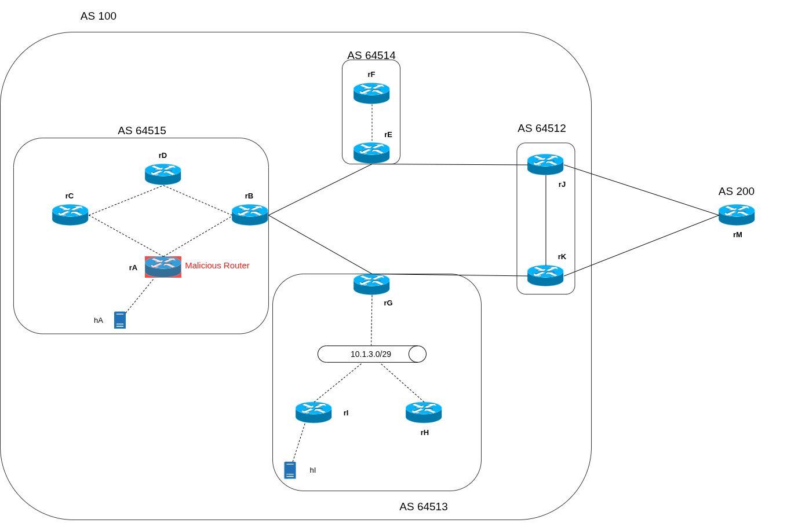

# bgp-frr-security
Virtual Lab using VNX( Virtual Networks over linuX) to test the security of BGP, performing Prefix Hijack and AS_PATH Forgery

Temas a implementar (borrador)

ECMP entre los dos AS frontera 

configuración completa de Routinator (ROAs y prefijos).

A Route Origin Authorization (ROA) is a cryptographically signed object that states which Autonomous System (AS) is authorized to originate a particular IP address prefix or set of prefixes.

Routinator como RPKI RTR client

Resource Public Key Infrastructure (RPKI) data. It validates the Route Origin Attestations contained in the data and makes them available to your BGP routing workflow.

Configuración de iBGP full mesh para AS 64515 y AS 64513

Confguración ruta estática AS 64514

Realizar los ataques de Prejix Hijack y AS_PATH Forgery desde el router malicioso

Proponer ataques desde el AS 200

Documentación extra:

https://reposit.haw-hamburg.de/bitstream/20.500.12738/17557/1/MA_Implementation%20and%20Evaluation%20of%20BGPsec%20for%20the%20FRRouting%20Suite.pdf
https://www.rfc-editor.org/rfc/rfc8205
https://docs.frrouting.org/en/latest/bgp.html#
https://nvlpubs.nist.gov/nistpubs/SpecialPublications/NIST.SP.800-189r1.ipd.pdf

Instalación routinator:
https://routinator.docs.nlnetlabs.nl/en/stable/installation.html
