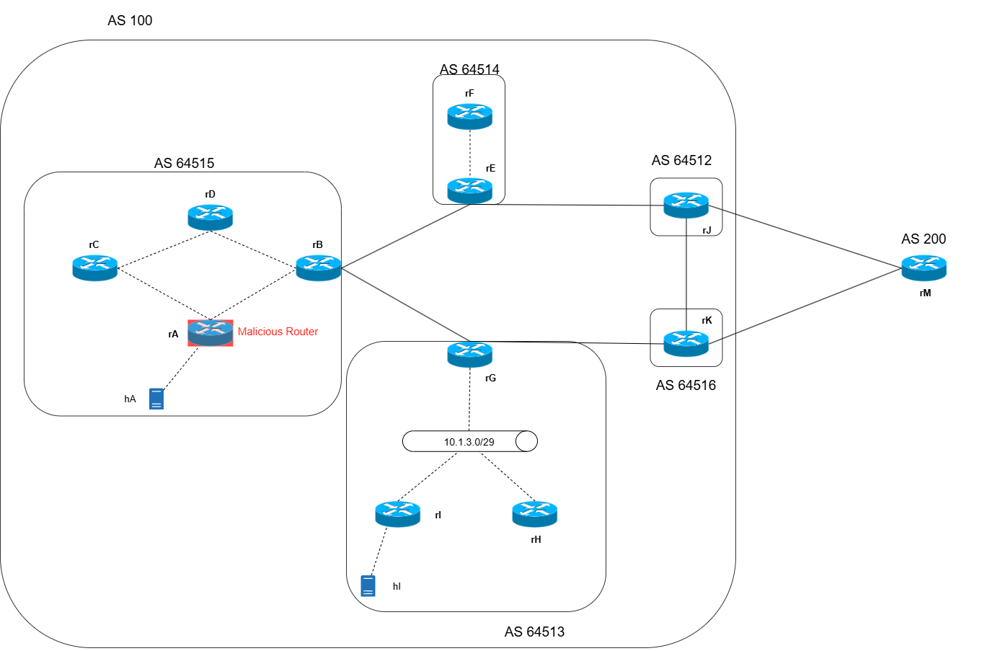

# bgp-frr-security
Virtual Lab using VNX( Virtual Networks over linuX) to test the security of BGP, performing Prefix Hijack and AS_PATH Forgery




## Description 

- The virtual lab if composed of various AS. The AS 100 is confederation of the AS with private numeration. 


- ECMP is implemented in the AS 64512 and AS 64516 towards AS 200


### IGP of the Autonomous Systems
Hosts:
| AS        | IGP          | Network         |   Description                                            |
|-----------|--------------|-----------------|----------------------------------------------------------|
| 64513     | OSPFv2       | 10.1.3.0/29     | Area 1, also contains the connection with hI             |
| 64514     | Static       | 10.1.2.1/30     | rF directly attached to rE                               |
| 64515     | EIGRP        | 10.1.1.0/28     | In addition, the IGP Contains the connection with hA     |
| ALL       | OSPFv2       | 192.168.1.0/24  | Area 0 between all AS of the confederation               |


## Set up of the virtual lab

### Change /etc/sysctl.conf to avoid issues during the start up of the virtual lab 

```bash
fs.inotify.max_queued_events = 2097152
fs.inotify.max_user_instances = 2097152
fs.inotify.max_user_watches = 2097152
```
After that execute:
```bash
sysctl --system
```

### VNX set up

You will need to modify the image that vnx uses:

username:root
password:xxxx

```bash
sudo vnx --modify-rootfs filesystems/vnx_rootfs_lxc_ubuntu64-22.04-v025-fw/
```
After entering in the virtualized system you will need to install routinator and a frr dependency for rpki

```bash
sudo vnx --modify-rootfs filesystems/vnx_rootfs_lxc_ubuntu64-22.04-v025-fw/

sudo apt install \
  ca-certificates \
  curl \
  gnupg \
  lsb-release

curl -fsSL https://packages.nlnetlabs.nl/aptkey.asc | sudo gpg --dearmor -o /usr/share/keyrings/nlnetlabs-archive-keyring.gpg

echo \
"deb [arch=$(dpkg --print-architecture) signed-by=/usr/share/keyrings/nlnetlabs-archive-keyring.gpg] https://packages.nlnetlabs.nl/linux/debian \
$(lsb_release -cs) main" | sudo tee /etc/apt/sources.list.d/nlnetlabs.list > /dev/null

sudo apt update

sudo apt install routinator
```
You must install frr-rpki-rtrlib additional package for RPKI support, otherwise bgpd daemon won’t startup.

```bash
sudo apt-get update
sudo apt-get install frr-rpki-rtrlib
```
After making the changes in the imagese execute the next command to save the changes:

```bash
halt
```

### Starting the virtual lab

```bash
sudo vnx -f frr-bgp.xml -v -t
```

In order to initialize the routinator service:

```bash
nohup routinator -c /root/rpkidata/routinator.conf server > /var/log/routinator.log 2>&1 &
```

If you want to check the service:

```bash
ss -tuln | grep 3323
```

IMPORTANT:

If you load the rpki configuration you would probably have problems with the connection with the rpki server.

Restart the networking service in rM

```bash
systemctl restart networking
```
And also you can restart the rpki connection with this command in frr in the routers that have an rpki connection: rE, rB, rJ, rG, rK

```bash
rpki restart
```

These commands will help you to check everything is working correctly:

```bash
show rpki prefix-table
show rpki cache-connection 
```
### Loading configuration

The routers have many possible configuration:

This confguration load the starting configuration for all routers:
```bash
sudo vnx -f frr-bgp.xml -x load_intial_conf
```
The configuration for rpki can be loaded with these commands:
```bash
sudo vnx -f frr-bgp.xml -x load_rpki
```


## Attacks 

The malicious router is rA wich form a neigbourd with rB via BGP, in order to perform these Attacks:

A Route Origin Authorization (ROA) is a cryptographically signed object that states which Autonomous System (AS) is authorized to originate a particular IP address prefix or set of prefixes.

Resource Public Key Infrastructure (RPKI) data. It validates the Route Origin Attestations contained in the data and makes them available to your BGP routing workflow.

### Prefix Hijacking

Occurs when a malicious BGP speaker falsely announces IP prefixes that it does not own or originate. This can redirect traffic through the attacker's network, enabling traffic interception or blackholing.

In this laboratory the attack will be performed by rA. 

This attack will be mitigated by implementing an rpki server in rM and using this rpki connection routers in the confederence will be protected against this attack.

In order to start the Prefix Hijackin execute:

```bash
sudo vnx -f frr-bgp.xml -x loadra_prefix_hijack
```

If you want to go back to the original rA configuration execute:

```bash
sudo vnx -f frr-bgp.xml -x loadra
```

### AS_PATH Forgery

Involves manipulating the AS_PATH attribute in BGP announcements by injecting fake AS numbers to make the route appear legitimate. This bypasses basic loop detection and can mislead routers into preferring malicious routes.

Currently this attack cannot be mitigated. In order to avoid this exploit. BGPsec must be implemented to validate the AS_PATH using PKI (Public Key Infrastructure). Currently frr does not implement BGPsec


In order to start the AS_PATH Forgery execute:

```bash
sudo vnx -f frr-bgp.xml -x loadra_as_path_forgery
```

If you want to go back to the original rA configuration execute:

```bash
sudo vnx -f frr-bgp.xml -x loadra
```

## IP Addresses:
Hosts:
| Host      | Interface    | IPv4            |   Network                              |
|-----------|--------------|-----------------|----------------------------------------|
| rA        | netA         | 10.10.1.2/30    | 10.10.1.0/30                           |
| rA        | netA-B       | 10.1.1.1/30     | 10.1.1.0/30                            |
| rA        | netA-C       | 10.1.1.14/30    | 10.1.1.12/30                           |
| hA        | netA         | 10.10.1.1/30    | 10.10.1.0/30                           |
| rB        | netA-B       | 10.1.1.2/30     | 10.1.1.0/30                            |
| rB        | netB-D       | 10.1.1.5/30     | 10.1.1.4/30                            |
| rB        | netB-E       | 192.168.1.1/30  | 192.168.1.0/30                         |
| rB        | netB-G       | 192.168.1.5/30  | 192.168.1.4/30                         |
| rC        | netA-C       | 10.1.1.13/30    | 10.1.1.12/30                           |
| rC        | netC-D       | 10.1.1.10/30    | 10.1.1.8/30                            |
| rD        | netB-D       | 10.1.1.6/30     | 10.1.1.4/30                            |
| rD        | netC-D       | 10.1.1.9/30     | 10.1.1.8/30                            |
| rE        | netB-E       | 192.168.1.2/30  | 192.168.1.0/30                         |
| rE        | netE-F       | 10.1.2.2/30     | 10.1.2.0/30                            |
| rE        | netE-J       | 192.168.1.9/30  | 192.168.1.8/30                         |
| rF        | netE-F       | 10.1.2.1/30     | 10.1.2.0/30                            |
| rG        | netB-G       | 192.168.1.6/30  | 192.168.1.4/30                         |
| rG        | netG-I-H     | 10.1.3.1/29     | 10.1.3.0/29                            |
| rG        | netG-K       | 192.168.1.13/30 | 192.168.1.12/30                        |
| rH        | netG-I-H     | 10.1.3.2/29     | 10.1.3.0/29                            |
| rI        | netI         | 10.10.1.6/30    | 10.10.1.4/30                           |
| rI        | netG-I-H     | 10.1.3.3/29     | 10.1.3.0/29                            |
| hI        | netI         | 10.10.1.5/30    | 10.10.1.4/30                           |
| rJ        | netE-J       | 192.168.1.10/30 | 192.168.1.8/30                         |
| rJ        | netJ-K       | 192.168.1.17/30 | 192.168.1.16/30                        |
| rJ        | netJ-M       | 172.16.1.1/30   | 172.16.1.0/30                          |
| rK        | netG-K       | 192.168.1.14/30 | 192.168.1.12/30                        |
| rK        | netJ-K       | 192.168.1.18/30 | 192.168.1.16/30                        |
| rK        | netK-M       | 172.16.1.5/30   | 172.16.1.4/30                          |
| rM        | netJ-M       | 172.16.1.2/30   | 172.16.1.0/30                          |
| rM        | netK-M       | 172.16.1.6/30   | 172.16.1.4/30                          |


## Documentation:


Routinator Installation guide:
https://routinator.docs.nlnetlabs.nl/en/stable/installation.html


RFC 8416 : Simplified Local Internet Number Resource Management with the RPKI (SLURM)                         
https://www.rfc-editor.org/rfc/rfc8416.html


BGP Hijacking real case:

https://www.certik.com/resources/blog/bgp-hijacking-how-hackers-circumvent-internet-routing-security-to-tear-the

Others:

https://reposit.haw-hamburg.de/bitstream/20.500.12738/17557/1/MA_Implementation%20and%20Evaluation%20of%20BGPsec%20for%20the%20FRRouting%20Suite.pdf
https://www.rfc-editor.org/rfc/rfc8205
https://docs.frrouting.org/en/latest/bgp.html#
https://nvlpubs.nist.gov/nistpubs/SpecialPublications/NIST.SP.800-189r1.ipd.pdf


